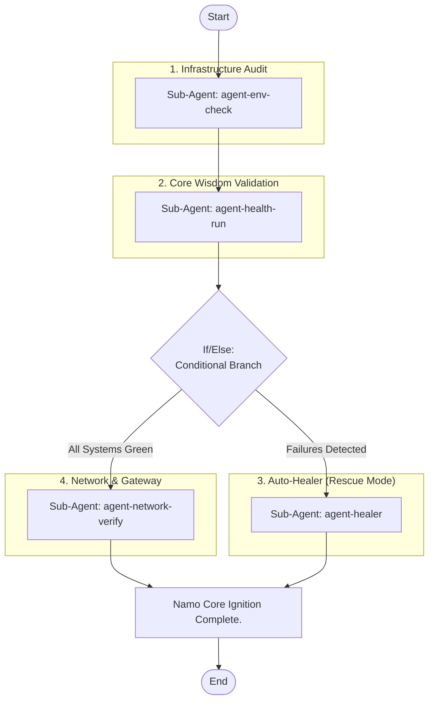

## Workflow Execution Guide

Follow the Mermaid flowchart above to execute the workflow. Each node type has specific execution methods as described below.

### Execution Methods by Node Type

- **Rectangle nodes (Sub-Agent: ...)**: Execute Sub-Agents
- **Diamond nodes (AskUserQuestion:...)**: Use the AskUserQuestion tool to prompt the user and branch based on their response
- **Diamond nodes (Branch/Switch:...)**: Automatically branch based on the results of previous processing (see details section)
- **Rectangle nodes (Prompt nodes)**: Execute the prompts described in the details section below

### Group Node Execution Tracking

This workflow contains group nodes. Before executing nodes within each group, call the `highlight_group_node` MCP tool on the `cc-workflow-studio` server to visually highlight the active group on the canvas.

| Group ID | Label |
|----------|-------|
| group-env | 1. Infrastructure Audit |
| group-validation | 2. Core Wisdom Validation |
| group-healing | 3. Auto-Healer (Rescue Mode) |
| group-network | 4. Network & Gateway |

Call example: `highlight_group_node({ groupNodeId: "<group-id>" })`

When the workflow completes, call `highlight_group_node({ groupNodeId: "" })` to clear the highlight.

## Sub-Agent Node Details

#### agent-env-check(Sub-Agent: agent-env-check)

**subagent_type**: explore

**Description**: Infrastructure & Secret Audit [NN-500]

**Prompt**:

```
1. Check ports 8000 (Backend), 5173 (Frontend), and 6379 (Redis).
2. Verify migration of secret logic to `config/gcp_secrets.py`.
3. Audit .env for Zero-Secret Policy.
4. Ensure Redis is reachable before starting health checks.
```

**Parallel Execution**: enabled

When executing this node, assess whether the task involves multiple independent areas or concerns.
If so, launch multiple agents of the same subagent_type in parallel — one per independent area.

Guidelines:
- Single area of concern → execute with 1 agent
- Multiple independent areas → spawn 1 agent per area, execute in parallel
- Wait for all agents to complete before proceeding to the next node
- Consolidate all agent results before passing to the next node

#### agent-health-run(Sub-Agent: agent-health-run)

**subagent_type**: explore

**Description**: Async & RAG Purity Audit (20/20) [NN-500]

**Prompt**:

```
1. Execute `python scripts/health_check.py --full`.
2. Parse stdout to confirm ALL 20/20 checks passed.
3. Audit all FastAPI endpoints for 'def' instead of 'async def' (Strictly no blocking calls).
4. Verify RAG quality for 168,861 vectors (Short Chunk Strategy).
5. Report any violations with a witty burn as Namo.
```

**Parallel Execution**: enabled

When executing this node, assess whether the task involves multiple independent areas or concerns.
If so, launch multiple agents of the same subagent_type in parallel — one per independent area.

Guidelines:
- Single area of concern → execute with 1 agent
- Multiple independent areas → spawn 1 agent per area, execute in parallel
- Wait for all agents to complete before proceeding to the next node
- Consolidate all agent results before passing to the next node

#### agent-healer(Sub-Agent: agent-healer)

**subagent_type**: general-purpose

**Description**: Diagnose & Auto-Heal

**Prompt**:

```
1. Read `logs/backend_error.log` and `logs/backend.log`.
2. Identify why health check failed (e.g., database locked, missing secret, model loading error).
3. Attempt to fix (e.g., restart backend service, fix port conflict).
4. Report action taken to the user.
```

**Parallel Execution**: enabled

When executing this node, assess whether the task involves multiple independent areas or concerns.
If so, launch multiple agents of the same subagent_type in parallel — one per independent area.

Guidelines:
- Single area of concern → execute with 1 agent
- Multiple independent areas → spawn 1 agent per area, execute in parallel
- Wait for all agents to complete before proceeding to the next node
- Consolidate all agent results before passing to the next node

#### agent-network-verify(Sub-Agent: agent-network-verify)

**subagent_type**: general-purpose

**Description**: Verify Tunnel & Gateway

**Prompt**:

```
1. Check status of `cloudflared` tunnel.
2. Verify that `api.namonexus.com` is routing correctly to localhost:8000.
3. Confirm SSL handshake and response code 200 for the gateway.
```

**Parallel Execution**: enabled

When executing this node, assess whether the task involves multiple independent areas or concerns.
If so, launch multiple agents of the same subagent_type in parallel — one per independent area.

Guidelines:
- Single area of concern → execute with 1 agent
- Multiple independent areas → spawn 1 agent per area, execute in parallel
- Wait for all agents to complete before proceeding to the next node
- Consolidate all agent results before passing to the next node

### Prompt Node Details

#### prompt-final-status(Namo Core Ignition Complete.)

```
Namo Core Ignition Complete.

**Status Summary:**
- Infrastructure: [Status]
- Core Health: [Passed/Failed]
- Network Gateway: [Status]

**Message:**
{{message}}

Everything is set for the Smart Classroom session.
```

### If/Else Node Details

#### if-health-passed(Binary Branch (True/False))

**Branch conditions:**
- **All Systems Green**: Health check = 16/16
- **Failures Detected**: Health check < 16/16

**Execution method**: Evaluate the results of the previous processing and automatically select the appropriate branch based on the conditions above.
